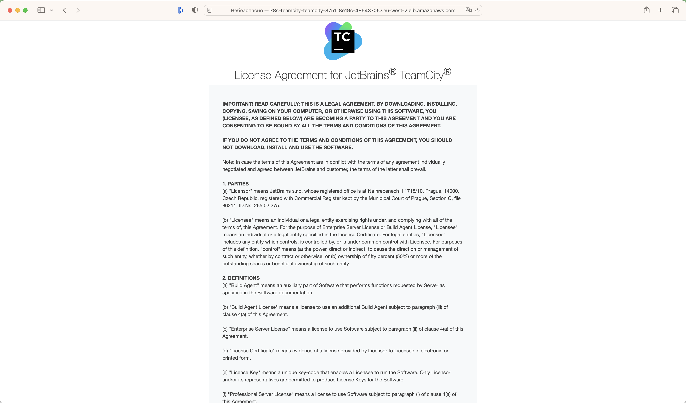
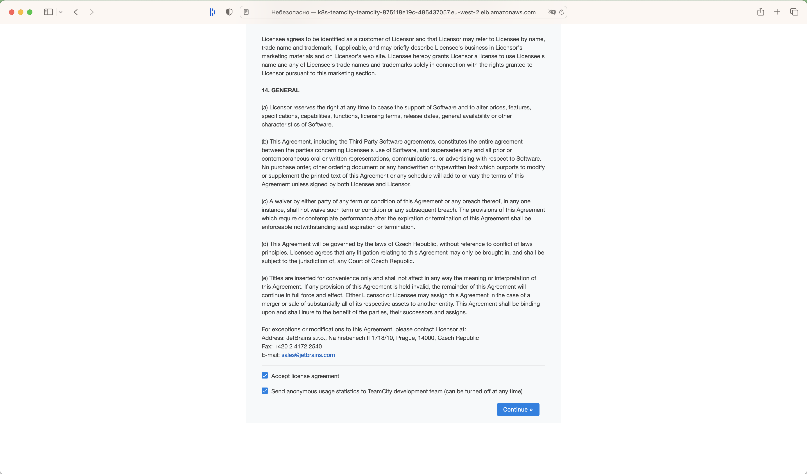
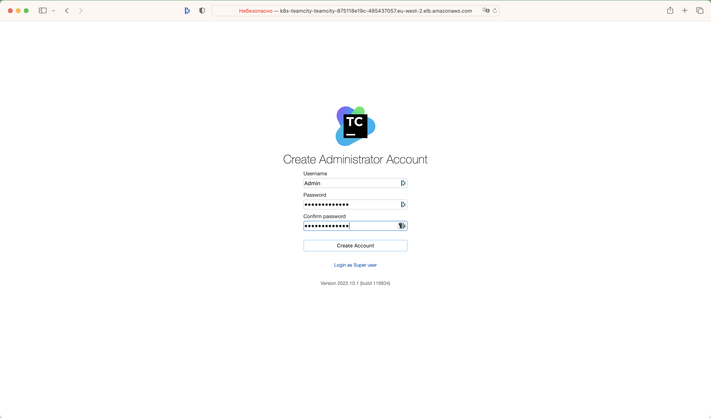
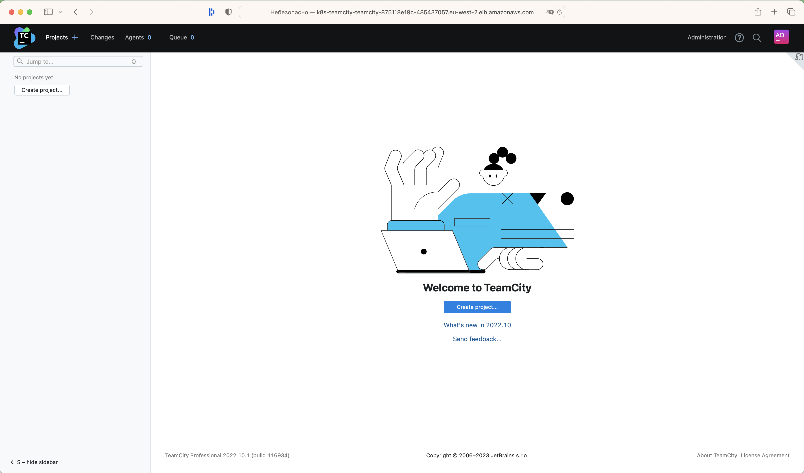
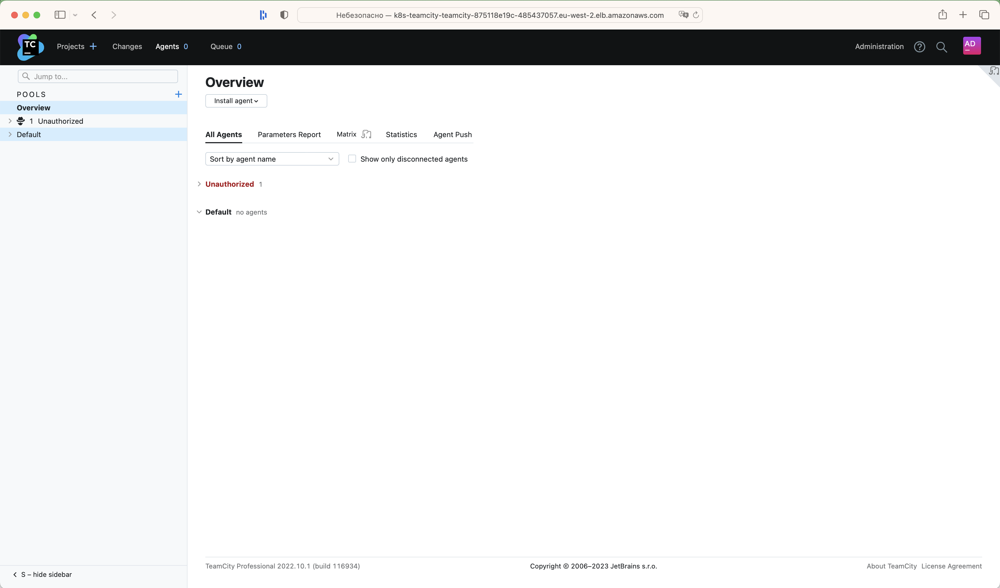
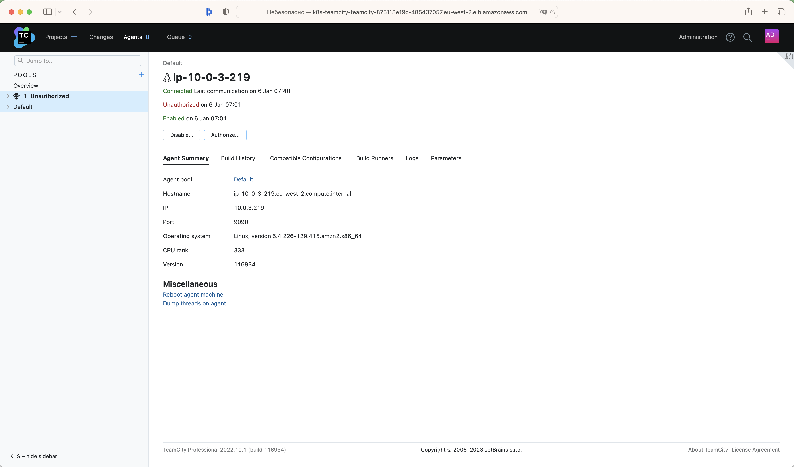
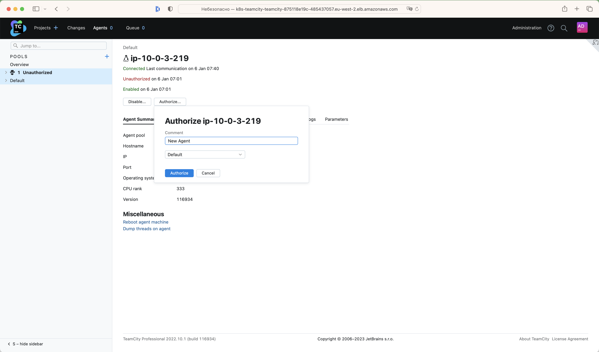
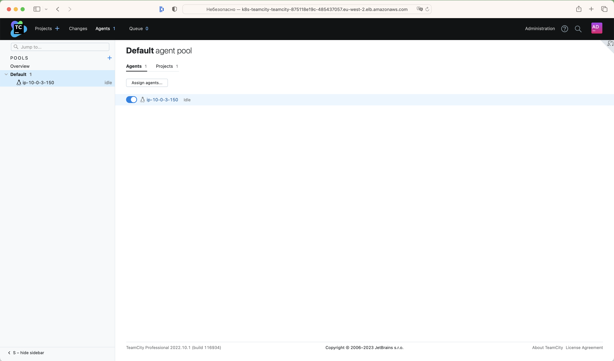
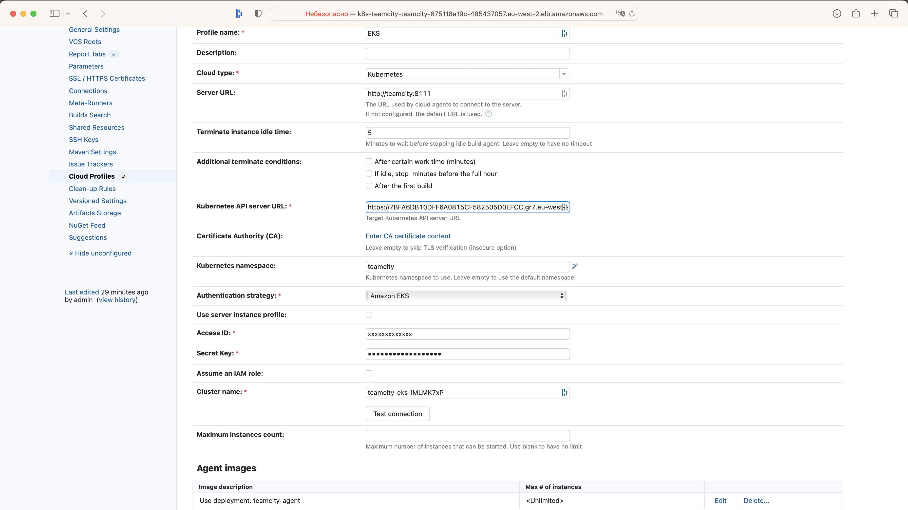

# Amazon AWS EKS, Amazon Aurora MySQL Database, TeamCity, S3 Storage, ALB  with terraform

Assuming you already have Amazon AWS account we will need additional binaries for AWS CLI, terraform, kubectl and aws-iam-authenticator.

The document is structured in 7 parts:

* Initial tooling setup aws cli, kubectl and terraform
* Creating terraform IAM account with access keys and access policy
* Creating back-end storage for tfstate file in AWS S3 
* Creating Kubernetes cluster on AWS EKS, Amazon Aurora MySQL Database, TeamCity Server with Agents, S3 storage
* Working with kubernetes "kubectl" in EKS
* Setting Up TeamCity Server
* Create a Test Project

## Initial tooling setup aws-cli, kubectl, terraform and aws-iam-authenticator

Assuming you already have AWS account and [AWS CLI installed](https://docs.aws.amazon.com/cli/latest/userguide/awscli-install-linux.html) and [AWS CLI configured](https://docs.aws.amazon.com/cli/latest/userguide/cli-chap-getting-started.html) for your user account we will need additional binaries for, terraform and kubectl.

### Deploying terraform

#### terraform for macOS

First, install the Hashicorp tap

```sh
brew tap hashicorp/tap
```

Now, install Terraform with hashicorp/tap/terraform

```sh
brew install hashicorp
```

[How to install terraform on another platforms](https://developer.hashicorp.com/terraform/tutorials/aws-get-started/install-cli#install-terraform)

### Deploying kubectl

#### kubectl for macOS

```sh
brew install kubectl
```

Test to ensure the version you installed is up-to-date:

```sh
kubectl version --client
```

[Install and Set UP kubectl on another platforms](https://kubernetes.io/docs/tasks/tools/)

### Deploying aws-iam-authenticator

[aws-iam-authenticator](https://github.com/kubernetes-sigs/aws-iam-authenticator) is a tool developed by [Heptio](https://heptio.com/) Team and this tool will allow us to manage EKS by using kubectl

#### aws-iam-authenticator for macOS

Install the aws-iam-authenticator with the following command.

```sh
brew install aws-iam-authenticator
```

Test that the aws-iam-authenticator binary works

```sh
aws-iam-authenticator help
```

[Installing aws-iam-authenticator on another platforms](https://docs.aws.amazon.com/eks/latest/userguide/install-aws-iam-authenticator.html)

### Authenticate to AWS

In below example I will be using US East "us-east-2""

```sh
aws configure
```

## Creating terraform IAM account with access keys and access policy

1st step is to setup terraform admin account in AWS IAM

### Create IAM terraform User

```sh
aws iam create-user --user-name terraform
```

### Add to newly created terraform user IAM admin policy

> NOTE: For production or event proper testing account you may need tighten up and restrict access for terraform IAM user


```sh
aws iam attach-user-policy --user-name terraform --policy-arn arn:aws:iam::aws:policy/AdministratorAccess
```

### Create access keys for the user

> NOTE: This Access Key and Secret Access Key will be used by terraform to manage infrastructure deployment

```sh
aws iam create-access-key --user-name terraform
```

### update terraform.tfvars file with access and security keys for newly created terraform IAM account


## Creating back-end storage for tfstate file in AWS S3

Once we have terraform IAM account created we can proceed to next step creating dedicated bucket to keep terraform state files

### Create terraform state bucket

> NOTE: Change name of the bucket, name should be unique across all AWS S3 buckets

```sh
aws s3 mb s3://teamcity-state-bucket --region us-east-2
```

### Enable versioning on the newly created bucket

```sh
aws s3api put-bucket-versioning --bucket teamcity-state-bucket --versioning-configuration Status=Enabled
```

## Creating Kubernetes cluster on AWS EKS, Amazon Aurora MySQL Database, TeamCity Server with Agents, S3 storage

Now we can move into creating new infrastructure, eks, rds, teamcity, s3 storage and TeamCity with terraform

I will use terraform modules to keep my code clean and organized

Terraform modules will create

* VPC
* EKS cluster
* Aurora Mysql Database
* TeamCity Server and 2 TeamCity Agents
* AWS Load Balancer Controller
* S3 Storage (Persistent Storage for pods)
* [Dataset Operator](https://github.com/datashim-io/datashim)

#### Initialize and pull terraform cloud specific dependencies

```sh
terraform init
```

Before we can start will need to update variables and add

- db password for teamcity db
- db master password for MySql Db Cluster
- AWS Access Key ID for access s3 storage
- AWS Access Key for access s3 storage

to terraform.tfvars

```sh
echo 'db_password="Your_DB_Passwd."' >> terraform.tfvars
echo 'db_master_password="Your_DB_Master_Passsword"' >> terraform.tfvars
echo 'access_key_id="Your_AWS_Access_KEY_ID' >> terraform.tfvars
echo 'secret_access_key="Your_AWS_Access_KEY"' >> terraform.tfvars
```

#### It's a good idea to sync terraform modules

```sh
terraform get -update
```

### View terraform plan

```sh
terraform plan
```

### Apply terraform plan

> NOTE: building complete infrastructure may take more than 10 minutes.

Create infrastructure(EKS and RDS)

```sh
terraform apply -var deploy_teamcity=false
```

Then deploy TeamCity application


```sh
terraform apply
```

## Working with kubernetes "kubectl" in EKS

Run the following command to retrieve the access credentials for your cluster and configure kubectl.

### Update kubeconfig

```sh
 aws eks --region $(terraform output -raw region) update-kubeconfig \
    --name $(terraform output -raw cluster_name)
```

## Setting Up TeamCity Server

### Get http url for teamcity server

```sh
kubectl get ingress/teamcity -n teamcity -o jsonpath='{.status.loadBalancer.ingress[0].hostname}'
```

> NOTE: In my case, the above command returned k8s-teamcity-teamcity-875118e19c-485437057.eu-west-2.elb.amazonaws.com

### Setting Up TeamCity

Open the browser and enter the url http://k8s-teamcity-teamcity-875118e19c-485437057.eu-west-2.elb.amazonaws.com



Scroll down, select "Accept License Agreement" and click continue:



Set username and password for administrator:



That’s it! We should now be able to see the TeamCity GUI:



Click "Agents" 



And then click "Authorize"



Write any comment and click the button



That’s it! We should now be able to see the available agent



> NOTE: If the pod is restarted you will have to authorize the agent again 

You can also connect agents using the [Kubernetes Support](https://plugins.jetbrains.com/plugin/9818-kubernetes-support?_ga=2.250338374.1973796019.1672818115-2146771399.1670918581&_gl=1*lol6m4*_ga*MjE0Njc3MTM5OS4xNjcwOTE4NTgx*_ga_9J976DJZ68*MTY3MzAwNDQ0MS4xOC4xLjE2NzMwMDQ0NDYuMC4wLjA.) plugin

The plugin will automatically deploy agents in the Kubernetes namespace and add them to the pool. 
If there is no activity, the plugin will stop idle agents.

### Setting Up for Kubernetes

To establish the integration with Kubernetes, you need to create a dedicated cloud profile in TeamCity. Open the settings of the required project and, under the Cloud Profiles section, click Create new profile.

My Cloud Profile



## Create Test Project

Let's create [Test Project](https://github.com/JackKrasn/teamcity-hello-project)  with Kotlin DSL.
